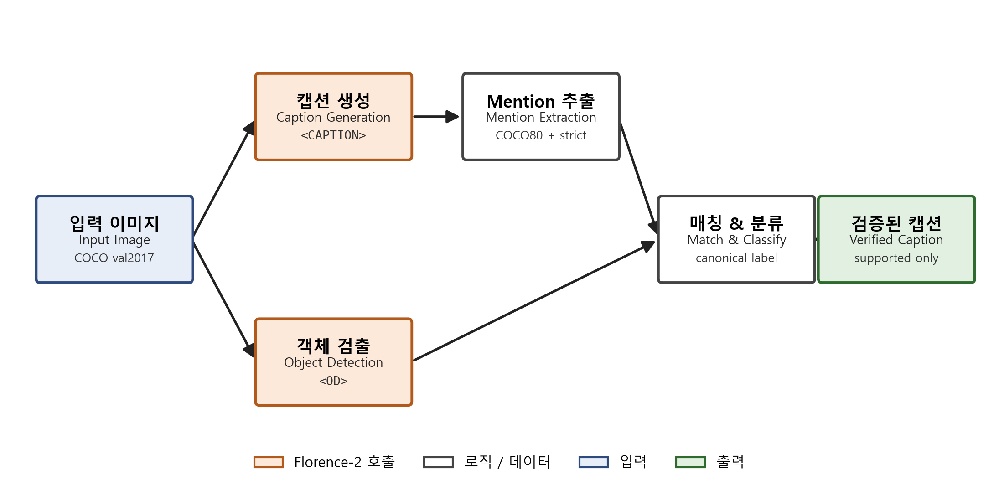

# Florence-2 기반 이미지 설명의 시각적 근거 검증 및 Hallucination 탐지

**Visual Evidence Verification for Image Caption Hallucination Detection using Florence-2**

°이시현 (20221802), 변진영 (20221794)
[학과명] · [대학교명]
{[shihyeon-email], byun142502@gmail.com}

> IPIU2026 워크샵 양식 (`Team/IPIU2026_sample/IPIU2026_sample.doc`) 으로 옮겨담을 한국어 논문 원고. 본문 4~6쪽 분량.
> 양식 규칙 — 제목 바탕체 14 bold, 본문 한글 바탕체 10 / 영문 Times New Roman 10, 장 번호 돋움체 12 bold, 표 캡션 상단·그림 캡션 하단 가운데 정렬, 발표자 이름 위에 `o` 표시 (위 블록의 `°` 마커가 발표자 표시. 발표자가 변진영이면 `°` 위치 교체).
>
> **사용자 채워야 할 것**: `[학과명]`, `[대학교명]`, 이시현 이메일, (필요 시) 발표자 변경.

---

## 요 약

본 연구는 통합 비전-언어 모델 Florence-2[1]의 captioning과 object detection 기능을 결합한 caption-detection consistency 검증 파이프라인을 구현하고, 그 효과와 한계를 실험적으로 분석한다. 파이프라인은 (i) `<CAPTION>` 결과에서 객체 mention을 추출하고, (ii) 동일 이미지의 `<OD>` 결과와 정규화된 라벨로 매칭하여 supported / unsupported로 판정하며, (iii) 평가 단계에서만 COCO GT와 비교하여 실제 hallucination 여부를 산정한다. COCO val2017 2000장 (mentions 2825건) 에서 Florence-2-large-ft는 baseline hallucination rate를 2.51%에서 검증 후 0.80%로 감소시켰으며 (95% CI 둘 사이 겹침 없음), unsupported 탐지 F1 = 0.690 [0.594, 0.770], supported & GT-present subset에 대한 grounding accuracy@0.5 = 94.88% (n=2732) 를 달성했다. 외부 POPE benchmark[4] 질문을 객체 존재 판정 문제로 변환하여 평가한 결과, 본 OD-based verification baseline은 random / popular / adversarial 세 split에서 89.97~91.34% 정확도를 보였다 (detector 기반 판정이라 generative LVLM 과의 직접 우열 비교는 아니며, visual evidence 기반 검증의 가능성을 보여주는 참고 결과로 해석한다). 또한 동의어 매핑 정책 ablation을 통해 generic-to-specific 매핑이 baseline hallucination rate를 약 80% 부풀릴 수 있음을 정량 입증한다. Cross-model 분석에서는 BLIP-large 와 modern LVLM 인 LLaVA-1.5-7B[6] 두 captioner 를 동일 Florence-2 OD 로 검증했으며, LLaVA 가 Florence-2 self 보다 ~5배 자주 hallucinate 함에도 (baseline 13.25%) 동일 검증이 이를 2.88%로 78% 상대 감소시켰다 (F1 = 0.809). 세 captioner 의 검증 recall 이 0.69~0.81 대역에 갇혀, 본 실험 범위에서 OD recall 이 검증 성능의 상한으로 작용함을 시사한다.

## 1. 서론

Florence-2[1], LLaVA[6], InstructBLIP[7], BLIP-2[8] 등 통합 비전-언어 모델(Vision-Language Model, VLM)이 자연스러운 이미지 설명을 생성하지만, **실제 이미지에 존재하지 않는 객체를 caption에 포함하는 object hallucination 문제**[3,4]가 지속적으로 보고되고 있다. 사용자가 caption만 보고 정보를 받아들이는 응용 — 접근성 보조, 검색 인덱스, 자동 보고서 — 에서 hallucination은 신뢰성을 직접 저해한다.

대표적 평가 방법인 CHAIR[3], POPE[4]는 caption mention과 데이터셋 GT 또는 yes/no 질문 응답을 비교한다. 이는 평가 시점엔 유용하지만 **사용 시점**에는 GT가 없으므로 적용할 수 없다. 한편 grounding/detection 단계에서 별도 모델을 사용하는 검증 방식은 추가 모델 비용을 요구한다.

본 연구는 Florence-2가 captioning과 object detection 을 **단일 prompt-conditioned 모델로 동시에 수행**할 수 있다는 점에 주목하여, 별도 모델 없이 같은 모델의 OD 결과를 visual evidence의 근사치로 사용하는 caption-detection consistency 검증 파이프라인을 구현·평가한다. 주된 기여는 다음과 같다.

1. Florence-2 단일 모델 위에서 동작하는 caption-detection consistency 검증 파이프라인의 설계와 구현.
2. COCO 80 카테고리 어휘에 대한 **strict synonym 매핑** 정책 정의 — generic-to-specific 매핑이 hallucination rate 를 인위적으로 부풀릴 수 있음을 정량적으로 보임.
3. COCO val2017 2000장 실험 (2825 mentions, 95% bootstrap CI 포함) 에서 baseline 2.51% → verified 0.80% 의 통계적으로 유의한 감소, F1 = 0.690 [0.594, 0.770]. 동일 설정 500장 × 3 seed 안정성 검증에서 F1 = 0.76~0.81 범위 (작은 표본 효과로 상한, 2000장이 더 안정된 추정치).
4. POPE 질문을 객체 존재 판정으로 변환한 외부 평가에서 89.97~91.34% 정확도 — generative LVLM 의 reported 값과의 비교는 *조건이 다른 detector-based baseline* 관점에서 보고.
5. Cross-model 분석 (BLIP-large·LLaVA-1.5-7B[6]) 으로, captioner 가 ~5배 더 자주 hallucinate 해도 (LLaVA baseline 13.25%) 동일 OD 검증이 일관되게 작동함을 (13.25→2.88%, F1 0.809) 보이고, 검증 recall 이 0.69~0.81 대역에 갇혀 OD recall 이 검증 성능의 상한임을 관찰.

## 2. 관련 연구

**Florence-2[1]**는 captioning, object detection, phrase grounding, segmentation, OCR 등 다양한 비전·비전-언어 과제를 *task prompt* 만 바꿔 단일 sequence-to-sequence 모델로 수행한다. FLD-5B 라는 대규모 multi-task 어노테이션으로 학습되어 작은 모델 크기에도 강한 성능을 보인다. 본 연구는 `<CAPTION>`, `<DETAILED_CAPTION>`, `<OD>`, `<CAPTION_TO_PHRASE_GROUNDING>` prompt 를 활용한다.

**Object hallucination 평가**. Rohrbach 등[3]은 CHAIR(Caption Hallucination Assessment with Image Relevance)를 도입해 caption mention이 GT 객체 집합에 포함되는지를 평가한다. POPE[4]는 "Is there a X in the image?" yes/no polling 으로 hallucination을 더 큰 LVLM 환경에서 비교한다. 본 연구는 두 metric의 변형을 모두 사용한다.

**COCO[2]**. 80개 객체 카테고리와 이미지당 캡션·인스턴스 어노테이션을 제공. hallucination 평가의 사실상 표준.

## 3. 방법

### 3.1 전체 파이프라인

본 시스템은 단방향 파이프라인이다 (그림 1).

*그림 1. Florence-2 단일 모델 기반 caption-detection consistency 검증 파이프라인. `<CAPTION>` 으로 추출된 객체 mention 을 동일 이미지에 대한 `<OD>` 결과와 strict synonym 매핑 하에 매칭하여 supported / unsupported 로 분류한다.*

1. **Caption 생성**: Florence-2 `<CAPTION>` 또는 `<DETAILED_CAPTION>` prompt 로 입력 이미지에 대한 caption을 생성한다.
2. **Object mention 추출**: COCO 80 카테고리 어휘 + **strict synonym 매핑 테이블** 을 사용해 caption에서 객체 mention을 추출한다.
3. **시각적 검증**: 같은 이미지에 `<OD>` prompt 를 한 번 호출, 검출된 모든 (라벨, bbox) 쌍을 동일 매핑으로 canonical 라벨로 정규화 후 각 mention의 canonical 과 매칭한다.
4. **분류**: 시스템 사용 시점에는 GT 가 없으므로, OD 와 매칭되지 않은 mention 을 **unsupported object** 로 표시한다. 사용자가 받는 verified caption은 supported mention만 남긴 형태이다.

본 연구는 phrase-level grounding 대신 `<OD>` 결과를 visual evidence 의 근사치로 사용한다. 따라서 본 실험의 consistency 는 엄밀히는 **caption–detection consistency** 에 해당한다.

### 3.2 Strict synonym 매핑 정책

caption의 자유 어휘를 COCO80 정식 라벨로 정규화하기 위해 동의어 매핑 테이블을 사용한다. 본 연구는 다음 두 변형을 비교한다.

- **aggressive (legacy)**: `table → dining table`, `baseball → sports ball`, `monitor → tv`, `stove → oven`, `plant → potted plant`, generic `glove → baseball glove` 등 *generic-to-specific* 매핑을 포함.
- **strict (ours)**: 위 generic-to-specific 매핑을 제거. 단순 복수형(`bikes → bicycle`)·언어 변형(`television → tv`, `cellphone → cell phone`)·의미 동치(`sofa → couch`)만 유지.

5.5절 ablation 에서 보이듯, aggressive vocab 은 baseline hallucination rate 를 약 80% 부풀리며, 본 연구의 모든 주 실험은 **strict vocab** 을 기본값으로 한다.

### 3.3 검증 (Verification) 전략

`<OD>` 결과의 각 라벨을 strict 매핑으로 canonical 라벨로 정규화하고, mention 의 canonical 과 일치하면 supported, 첫 매칭의 bbox가 시각적 근거로 부여된다. 대안으로 mention 1개당 `<CAPTION_TO_PHRASE_GROUNDING>` 을 호출하는 방식도 구현했으나, 호출 횟수가 mention 수에 비례해 계산 비용이 증가한다. 본 프로젝트에서는 일괄 검출이 가능한 `<OD>` 전략을 주된 방법으로 사용한다.

### 3.4 평가 지표

COCO GT 는 **평가 시점에만** 사용된다. unsupported object 중 실제로 GT 에도 존재하지 않는 mention 이 hallucination detection 의 TP 로 계산된다.

| 지표 | 정의 |
| --- | --- |
| Hallucination Rate | (canonical ∉ image GT) / total mentions |
| Verified Hallucination Rate | (canonical ∉ GT) / supported mentions |
| Unsupported P / R / F1 | TP = unsupp 예측 AND canonical ∉ GT ; FP = unsupp 예측 AND canonical ∈ GT ; FN = sup 예측 AND canonical ∉ GT ; TN = sup 예측 AND canonical ∈ GT |
| Grounding Acc@0.5 | supported 로 분류된 mention 중, GT 에 동일 카테고리 박스가 존재하는 부분집합 (n 명시) 에 대해 예측 bbox 와 GT bbox 의 max IoU ≥ 0.5 인 비율 |
| POPE accuracy / F1 | yes/no 응답의 4-cell confusion |

본 연구의 모든 비율 지표는 percentile bootstrap (n=1000, seed=42) 95% 신뢰구간을 함께 보고한다.

## 4. 실험

### 4.1 데이터셋
- **주 실험**: COCO val2017[2] (5,000장) 에서 시드 7로 무작위 추출한 **2000장** (`instances_val2017.json` 전체 ID 풀에서 샘플링).
- **안정성 검증**: 같은 풀에서 시드 7 / 42 / 123 × 500장 — 3 개 독립 표본.
- **POPE**: 표준 POPE 평가 — random / popular / adversarial 세 split, 각 3,000 yes/no 질문, 500개 val2014 unique images.
- **Cross-model**: 주 실험 2000장 풀의 앞쪽 500장.
- **Ablation**: 같은 2000장 풀의 앞쪽 500장에 대해 어휘 정책·prompt·검증 전략 변경.

### 4.2 모델 / 환경
- 주 모델: `microsoft/Florence-2-large-ft` (~770M parameters).
- Cross-model captioner: `Salesforce/blip-image-captioning-large`[5] (~470M) 및 `llava-hf/llava-1.5-7b-hf`[6] (~7B parameters).
- 보조 분석: `microsoft/Florence-2-base-ft` (~230M).
- 하드웨어: 본 연구의 2000장 주 실험과 LLaVA-1.5-7B cross-model 실험은 NVIDIA RTX 4090 (24 GB VRAM) 에서 수행; 500 장 보조 실험과 초기 ablation 은 NVIDIA RTX 3070 (8 GB VRAM) 에서 수행.
- 라이브러리: PyTorch 2.5.1 + CUDA 12.1, `transformers==4.49.0` (Florence-2 trust_remote_code 호환), fp16 추론.
- 디코딩: `num_beams=3`, `do_sample=False`. 추가 학습 없는 zero-shot inference.

### 4.3 Baseline / 제안 방법
- **Baseline**: `<CAPTION>` 결과의 모든 mention을 그대로 인정. Hallucination rate = (GT에 없는 mention) / total.
- **Proposed**: `<OD>` 로 검증해 supported mention만 인정. unsupported를 hallucination candidate로 표시·제거.

## 5. 결과

### 5.1 주 결과 — 2000장 strict CAPTION

**표 1. Florence-2-large-ft, COCO val2017 2000장 (seed=7), strict vocab, `<CAPTION>` prompt 주 실험 결과** (95% bootstrap CI)

| Method | Mentions | Baseline Hall% | Verified Hall% | F1 (Unsupp) | Grd Acc@0.5 (n=2732) |
| --- | --: | --: | --: | --: | --: |
| `<CAPTION>` baseline | 2825 | 2.51 [1.98, 3.15] | – | – | – |
| **Ours (verified)** | **2754** | – | **0.80 [0.47, 1.13]** | **0.690 [0.594, 0.770]** | **94.88** |

검증을 통해 hallucination rate 가 통계적으로 유의하게 감소 (CI 겹침 없음). Confusion matrix: TP=49, FP=22, FN=22, TN=2732 → Precision=0.690, Recall=0.690 (대칭).

`<CAPTION>` 은 짧고 보수적인 설명을 생성하기 때문에 baseline hallucination rate 가 2.51% 로 낮다. 그러나 5.2 절에서 보듯 `<DETAILED_CAPTION>` 에서는 mention 수가 약 50% 증가하고 hallucination rate 도 6.07% 로 상승하여, caption 이 자세해질수록 object hallucination 문제가 더 뚜렷하게 나타난다.

**표 1b. 제거(removal) 통계 — 시스템이 "단순히 많이 지운 것" 이 아님을 보이는 분석**

| 항목 | 값 |
| --- | --: |
| Total mentions | 2825 |
| Removed as unsupported | 71 |
| Correctly removed (TP, hallucination) | 49 |
| Incorrectly removed valid mentions (FP) | 22 |
| Remaining supported mentions | 2754 |
| Remaining hallucinations (FN) | 22 |
| **Mention retention rate** | **97.5%** |

전체 mention 의 97.5% 가 유지되었고, 제거된 71건 중 49건이 실제 GT 에 부재한 hallucination 이었다 (precision 0.690). 즉 *많은 mention 을 일괄 삭제하여 rate 를 낮춘 것이 아니라* unsupported mention 을 선택적으로 제거한 결과이다.

**표 1c. 같은 풀의 500장에 대해 3 개 독립 seed 안정성 검증**

| Seed | Mentions | Baseline (%) | Verified (%) | P | R | F1 |
| --- | --: | --: | --: | --: | --: | --: |
| 7 | 732 | 2.46 | 0.70 | 0.929 | 0.722 | 0.812 |
| 42 | 689 | 3.34 | 1.04 | 0.842 | 0.696 | 0.762 |
| 123 | 724 | 3.31 | 0.85 | 0.818 | 0.750 | 0.783 |
| **mean (산술 평균)** | **715** | **3.04** | **0.86** | **0.863** | **0.723** | **0.786** |

500장 규모에서는 F1 이 0.76~0.81 범위로 시드에 따라 변동한다. 2000장 (seed=7) 은 같은 seed=7 500장 (F1=0.812) 을 부분집합으로 포함하는 *상위 집합* 이며, 추가된 1500장에서 OD 의 over-flag 가 누적되어 FP가 1→22로 늘면서 F1 이 0.690 으로 수렴했다. 즉 500장 F1=0.812 는 작은 표본에서 *FP 가 우연히 적게 발생한* 낙관적 추정치이고, 2000장 (CI [0.594, 0.770]) 이 본 시스템의 안정적·보수적 성능 측정치이다.

### 5.2 `<DETAILED_CAPTION>` 보조 실험

**표 2. 같은 500장에 대해 `<DETAILED_CAPTION>` 으로 실험**

| Method | Mentions | Baseline Hall% | Verified Hall% | F1 | Grd Acc@0.5 |
| --- | --: | --: | --: | --: | --: |
| `<DETAILED_CAPTION>` baseline | 1121 | 6.07 [4.73, 7.40] | – | – | – |
| Ours (verified) | 1071 | – | **2.99 [2.05, 4.01]** | 0.610 [0.495, 0.710] | 93.94 |

DETAILED는 mention 53% 더 많지만 baseline rate가 **2.5× 더 높음** (긴 caption은 더 hallucinate, 문헌과 일치[4]). FP 14건은 대부분 작은 식기류 (bowl, spoon, bottle) 와 욕실 객체 (sink) — *captioner는 정확하지만 OD가 작은 객체를 못 잡음*.

### 5.3 POPE 외부 평가

POPE 의 "Is there a {object} in the image?" 질문을 Florence-2 `<OD>` 결과에 대한 객체 존재 판정으로 변환하여 응답을 산출했다.

**표 3. POPE 질문에 대한 OD-based verification (Florence-2-large-ft, strict vocab)**

| Split | Acc | Precision | Recall | F1 |
| --- | --: | --: | --: | --: |
| random | 91.34 | 99.27 | 83.65 | 90.79 |
| popular | 90.83 | 97.36 | 83.65 | 89.99 |
| adversarial | 89.97 | 95.53 | 83.65 | 89.20 |

참고로, POPE 원논문[4] 및 후속 보고에서 generative LVLM 들의 같은 split 정확도는 대체로 MiniGPT-4 72~79%, mPLUG-Owl2 83~86%, InstructBLIP[7] 83~88%, LLaVA-1.5-7B[6] 84~88% 범위로 보고되어 있다. 본 OD-based baseline 의 위 수치 (90~91%) 가 이를 상회하지만 — **두 방식은 task setting 이 다르다** (LVLM 은 yes/no 자연어 응답, 본 baseline 은 detector 라벨 일치 판정). 따라서 표 3 에는 본 연구 수치만 제시하고, LVLM 과의 비교는 *직접적인 모델 우열 비교가 아닌 visual evidence 기반 검증의 가능성을 보여주는 참고 정보* 로만 해석한다. Precision 이 매우 높다 (95~99%) — OD 는 보수적이라 false positive 를 거의 만들지 않는다.

세 split 에서 recall 이 83.65% 로 정확히 동일하게 나타난 것은, 본 평가에 사용한 POPE 파일들에서 *positive (yes-label) 질문 집합이 split 간에 공유되어* 있고 각 split 이 *서로 다른 negative (no-label) 질문* 으로만 차이를 만드는 구조와 일관된다. 따라서 이를 일반적인 16% 누락률로 단정하기보다는, 본 POPE 설정에서 Florence-2 OD 가 보수적인 positive 판정을 수행했다는 증거로 해석한다.

### 5.4 Cross-model 분석

**표 4. 같은 500장에서 self vs cross 검증** (95% CI 본문 생략)

| Setting | Mentions | Baseline | Verified | P | R | F1 | TP / FN |
| --- | --: | --: | --: | --: | --: | --: | --- |
| **Self** (Florence-2 caption + Florence-2 OD) | 732 | 2.46 | 0.70 | 0.929 | 0.722 | 0.812 | 13 / 5 |
| **Cross** (BLIP-large caption + Florence-2 OD) | 739 | 4.74 | 1.54 | 0.889 | 0.686 | 0.774 | 24 / 11 |
| **Cross** (LLaVA-1.5-7B caption + Florence-2 OD) | 2400 | 13.25 | 2.88 | 0.806 | 0.811 | 0.809 | 258 / 60 |

세 captioner 의 baseline hallucination 양은 뚜렷이 다르다 — Florence-2 self 2.46%, BLIP-large 4.74%, LLaVA-1.5-7B[6] 13.25% 로, 더 표현력이 강하고 장황한 LVLM 일수록 caption 당 객체를 더 많이 나열하며 (LLaVA 는 동일 500장에서 2,400 mention 으로 Florence-2/BLIP 의 약 3배) 그만큼 더 자주 hallucinate 한다. 핵심 관찰은 *captioner 를 바꿔도 동일한 Florence-2 `<OD>` 검증이 일관되게 작동* 한다는 점이다: LLaVA 의 13.25% baseline 을 2.88% 로 78% 상대 감소시키며 (F1 = 0.809 [0.775, 0.843]), 이는 Florence-2 self 의 F1 0.812 와 사실상 동등하고 표본 (mention 2,400, hallucination 318건) 이 큰 만큼 CI 도 세 설정 중 가장 좁다. 검증 recall 은 세 설정에서 0.69~0.81 범위에 분포한다. recall 이 1 에 도달하지 못하고 이 대역에 갇히는 것 — 즉 어떤 captioner 를 쓰더라도 OD 가 일정 비율의 hallucination 을 놓치는 것 — 은 본 실험 범위에서 **OD recall 이 검증 성능의 상한(ceiling)** 으로 작용함을 시사한다. 다만 recall 이 captioner 에 *완전히 불변* 인 것은 아니며 (BLIP 0.686 → LLaVA 0.811), mention pool 이 크고 hallucination 이 풍부할수록 recall 추정치가 더 높고 안정적이다. precision 은 mention 수가 늘수록 OD 가 놓친 실재 객체 (FP) 가 함께 늘어 다소 하락한다 (0.929 → 0.806). 같은 방향의 OD recall 신호가 POPE recall 83.65% 에서도 관찰된다.

### 5.5 Ablation — Vocab / Prompt / Verification Strategy

**표 5. 같은 500장 (seed=7) 에 대한 ablation**

| 변형 | Mentions | Baseline | Verified | F1 |
| --- | --: | --: | --: | --: |
| **strict + `<CAPTION>` + `<OD>` (main)** | 732 | 2.46 | 0.70 | 0.812 |
| aggressive vocab | 782 | 4.48 | 1.46 | 0.787 |
| `<DETAILED_CAPTION>` 변경 | 1121 | 6.07 | 2.99 | 0.610 |
| `<CAPTION_TO_PHRASE_GROUNDING>` 변경 | 732 | 2.46 | 2.46 | 0.000 |

**Vocab**: aggressive 매핑은 baseline rate 를 약 80% 부풀리지만 (2.46 → 4.48) F1 은 거의 변화 없다. 추가된 50 mention 의 대다수가 `table`, `baseball`, `monitor`, `plant`, `stove`, `glove` 같은 generic-to-specific 매핑에서 만들어진다. 본 결과는 object hallucination 평가에서 어휘 정규화 정책이 결과에 큰 영향을 줄 수 있음을 보여준다.

**Prompt**: `<DETAILED_CAPTION>` 은 mention 을 53% 더 추출하지만 baseline hallucination rate 가 2.5× 상승. detailed caption 환경에서는 OD 가 작은 객체를 못 잡아 FP 가 증가 → F1 큰 폭 감소 (0.812 → 0.610).

**검증 전략**: `<CAPTION_TO_PHRASE_GROUNDING>` 은 본 실험에서 모든 mention 에 대해 적어도 하나의 bbox 를 반환하여 unsupported 가 0건이 되었다 (F1 = 0). 즉 phrase grounding 은 검증 신호로 작동하지 않으며, **본 연구에서 `<OD>` 가 일관되게 더 적합한 verification primitive 임을 보인다**. 보다 상세한 비교는 5.6 절에 별도 표로 제시한다.

### 5.6 검증 전략(Verification Primitive) Ablation — `<OD>` vs `<CAPTION_TO_PHRASE_GROUNDING>`

본 연구가 phrase-level grounding 대신 `<OD>` 를 verification primitive 로 채택한 결정은 비용 측면뿐 아니라 *유효성* 측면에서도 결정적이다. 이를 직접 보이기 위해, 동일한 500장 (seed=7) · 동일한 strict vocab · 동일한 mention 집합 (n=732) 에 대해 검증 단계만 `<OD>` 와 `<CAPTION_TO_PHRASE_GROUNDING>` 으로 바꿔 비교한다.

**표 6. 동일 500장 (seed=7), strict vocab, `<CAPTION>` 으로 추출된 동일 mention 집합 (n=732) 에 대해 검증 prompt 만 교체한 ablation**

| 검증 전략 | Mentions | Supported / Unsupp. | Baseline Hall% | Verified Hall% | Precision | Recall | F1 [95% CI] | Mention Retention | Grd Acc@0.5 |
| --- | --: | --: | --: | --: | --: | --: | --: | --: | --: |
| **`<OD>` (main)** | 732 | 718 / 14 | 2.46 [1.50, 3.55] | **0.70 [0.14, 1.39]** | **0.929** | **0.722** | **0.812 [0.636, 0.941]** | 98.1% | **95.65** |
| `<CAPTION_TO_PHRASE_GROUNDING>` | 732 | 732 / **0** | 2.46 [1.50, 3.55] | 2.46 [1.50, 3.55] | 0.000 | 0.000 | **0.000 [0.000, 0.000]** | 100.0% | 92.997 |

`<CAPTION_TO_PHRASE_GROUNDING>` 은 본 설정에서 *732 mention 모두에 대해 적어도 하나의 bbox 를 반환* 하여 unsupported 가 단 한 건도 만들어지지 않았다 (confusion matrix: TP=0, FP=0, FN=18, TN=714). 결과적으로 검증 전후 hallucination rate 가 동일한 2.46% 로 유지되며, F1 은 정의상 0 이 된다. 즉 phrase grounding 은 *주어진 mention 어구가 무엇이든 항상 supported 로 판정* 하는 degenerate verifier 로 동작한다 — 이는 phrase grounding prompt 가 *주어진 어구의 시각적 근거를 회의적으로 검증* 하기보다는 *주어진 어구가 가리킨다고 가정한 영역을 회수* 하는 retrieval-style task 로 학습되었기 때문으로 해석된다. 반면 `<OD>` 는 객체 라벨을 *모델 스스로의 vocabulary* 에서 생성하므로, caption mention 의 canonical 라벨이 OD 출력 집합에 부재할 수 있다는 *비대칭* 이 진짜 검증 신호의 원천이 된다. 따라서 본 연구의 `<OD>` 채택은 cost 측면만이 아니라 hallucination detection F1 측면에서도 정당화된다 (0.812 vs 0.000, 같은 mention 집합).

### 5.7 정성 분석 (그림 2~4, 모두 2000장 메인 실험에서 추출)

- **그림 2 — Joint failure (FN, 2D 표현 환각)**: `image_id 415238` caption *"A painting of a vase of flowers on a table"* — 입력 이미지는 식탁 위 꽃병을 그린 **회화** 이며 COCO GT 는 `chair, potted plant` 로 회화 속 vase 를 별도 객체로 두지 않는다. 그러나 (i) mention extraction 이 caption 의 *"painting of"* 라는 2D 단서를 잃고 `vase` 를 추출하고, (ii) `<OD>` 도 회화 안에서 vase 위치에 bbox 를 그려 → 검증 통과. 본 시스템은 *3D 실재 객체* 와 *그림·사진·조각상 같은 2D/replica 표현* 을 구분하지 않는다.
- **그림 3 — OD recall 한계 (FP)**: `image_id 27696` caption *"A person cutting a pizza with a knife and fork"* — GT 에 `knife` 가 실제로 존재. 그러나 `<OD>` 가 작은 knife 를 검출하지 못해 시스템이 정상 객체를 unsupported 로 잘못 깃발 → over-flag. small-object detection 한계의 직접 증거.
- **그림 4 — 검증 성공 (TP)**: `image_id 41488` caption *"A green highway sign that says no trucks on it"* — caption 이 표지판의 *글자* "trucks" 를 인식해 truck mention 을 만들지만 GT 에 truck 은 없음. `<OD>` 도 truck 을 검출하지 않아 시스템이 정확히 unsupported 로 깃발 → 검증의 의도된 동작.

## 6. 논의

### 6.1 핵심 발견 요약

1. **strict vocab + 2000장 실험**에서 검증이 hallucination 을 통계적으로 유의하게 감소시켰다 (2.51 → 0.80%, CI 겹침 없음, F1 = 0.690 [0.594, 0.770]). 동시에 mention retention 97.5% 로 over-deletion 이 아님을 확인.
2. **POPE 객체 존재 판정 변환 실험**에서 본 OD-based baseline 의 정확도 (90~91%) 가 보고된 LVLM 값보다 높다. 다만 task setting 이 달라 직접적인 모델 우열로 해석하지 않는다.
3. **Cross-model 비교** (BLIP-large·LLaVA-1.5-7B caption + 동일 Florence-2 OD, 각 500장) 에서 captioner 의 baseline hallucination 이 2.46% → 4.74% → 13.25% 로 크게 다름에도 동일 검증이 일관되게 작동했다 (LLaVA 13.25 → 2.88%, F1 0.809). 검증 recall 은 0.69~0.81 대역에 분포해 *OD recall 이 검증 성능의 상한* 임을 시사한다. 다만 recall 이 captioner 에 완전히 불변은 아니며, mention pool 이 클수록 추정치가 더 높고 안정적이다.
4. **Synonym vocab 정책** 이 hallucination 측정에 큰 영향을 미친다는 점을 ablation 으로 보였다. aggressive 매핑 사용 시 baseline 이 과대평가될 수 있다.

### 6.2 한계
1. **본질적 self-verification 사각**: caption 과 OD 가 동시에 같은 방향으로 잘못 인식하는 joint failure 는 잡지 못한다 (정성 그림 2 가 직접 증거).
2. **OD recall 한계**: small / occluded / partial 객체에서 OD 가 검출에 실패. 본 실험과 POPE 모두에서 일관되게 관찰됨.
3. **어휘 한정**: COCO 80 밖 객체 (tripod, plate, rice 등) 는 추출 자체가 불가능.
4. **Caption correction 단순함**: verified caption 은 unsupported mention 을 *제거* 만 한다. 보다 부드러운 보정 (신뢰도 표시, 부분 수정) 은 향후 과제.
5. **본 실험은 객체 존재 hallucination 에 한정**. attribute / relation hallucination 은 측정 범위 밖.
6. **표본 크기**: 메인 2000장 (hallucination 71 건) 은 안정적 추정치를 제공한다. cross-model 분석은 각 500장이며, LLaVA 설정은 verbose caption 덕에 mention 2,400 · baseline hallucination 318 건으로 가장 큰 표본을 제공해 가장 좁은 F1 CI ([0.775, 0.843]) 를 얻었다. 반면 BLIP 설정 (35 건) 은 상대적으로 작아 더 큰 표본에서의 재검증이 바람직하다.
7. **GT annotation gap 에 의한 추정 편향**: 본 연구를 포함한 CHAIR 계열 평가는 COCO `instances_val2017` 의 카테고리 어노테이션을 *완전한 ground truth* 로 가정한다. 그러나 COCO 는 accessory (예: bow tie, 모자), 비-사람 위 객체, 작은 부속 객체를 일관되게 누락하는 것으로 알려져 있다. 시스템이 *시각적으로 분명히 존재하는* 객체를 supported 로 통과시키더라도 COCO GT 에 그 카테고리가 없으면 본 metric 은 이를 FN (놓친 hallucination) 으로 카운트한다. 이로 인해 본 페이퍼의 hallucination rate · F1 추정치는 *체계적으로 비관 편향* 되어 있을 가능성이 있으며, 동일 편향이 baseline 과 verified 양쪽에 동일하게 작용하므로 **상대 비교 (감소량, F1)** 는 신뢰 가능하지만 *절대값* 은 보수적으로 해석되어야 한다.

### 6.3 향후 방향
1. captioner와 verifier를 분리해 *서로 다른 모델*로 운용 (본 연구의 Cross-model 실험은 BLIP-large 와 modern LVLM 인 LLaVA-1.5-7B[6] 두 사례를 보였으며, 더 다양한 LVLM 으로의 확장이 가능).
2. SAM2 등 segmentation 결합으로 더 정밀한 visual evidence.
3. 더 큰 OD 모델 또는 open-vocabulary detector (GroundingDINO, OWL-ViT) 로 small-object recall 개선.
4. attribute / relation hallucination 까지 확장.
5. 한국어 caption verification.

## 7. 결론

본 연구는 Florence-2 의 통합 multi-task 능력을 활용한 caption-detection consistency 검증 파이프라인을 구현하고 그 효과와 한계를 실험적으로 분석했다. COCO val2017 2000 장 strict vocab 실험에서 hallucination rate 가 2.51% 에서 0.80% 로 통계적으로 유의하게 감소했으며 (F1 = 0.690 [0.594, 0.770], mention retention 97.5%), POPE 질문을 객체 존재 판정으로 변환한 외부 baseline 에서 89.97~91.34% 정확도를 보였다. Synonym 매핑 ablation 을 통해 어휘 정책이 hallucination 측정에 큰 영향을 줄 수 있음을 정량적으로 보였고, cross-model 비교 (BLIP-large·LLaVA-1.5-7B) 에서는 captioner 가 ~5배 더 자주 hallucinate 해도 동일 검증이 일관되게 작동하며 (LLaVA 13.25→2.88%, F1 0.809), 검증 recall 이 0.69~0.81 대역에 갇혀 본 실험 범위에서 OD recall 이 검증 성능의 상한임을 시사했다. 단일 통합 VLM 기반 self-verification 의 실용성과 동시에 그 한계의 위치를 함께 보고하는 것이 본 연구의 기여이다.

## 감사의 글

본 연구는 컴퓨터비전 과목 프로젝트(15팀 다반)의 일환으로 수행되었다. 본 연구의 코드와 재현 가능한 실험 스크립트는 다음 저장소에서 공개된다: `https://github.com/jeeen0/florence2-hallucination-detection`.

## 참고문헌

[1] B. Xiao et al., "Florence-2: Advancing a Unified Representation for a Variety of Vision Tasks," CVPR 2024.

[2] T. Y. Lin et al., "Microsoft COCO: Common Objects in Context," ECCV 2014.

[3] A. Rohrbach et al., "Object Hallucination in Image Captioning," EMNLP 2018.

[4] Y. Li et al., "Evaluating Object Hallucination in Large Vision-Language Models (POPE)," EMNLP 2023.

[5] J. Li et al., "BLIP: Bootstrapping Language-Image Pre-training," ICML 2022.

[6] H. Liu et al., "Visual Instruction Tuning (LLaVA)," NeurIPS 2023.

[7] W. Dai et al., "InstructBLIP: Towards General-purpose Vision-Language Models with Instruction Tuning," NeurIPS 2023.

[8] J. Li et al., "BLIP-2: Bootstrapping Language-Image Pre-training with Frozen Image Encoders and Large Language Models," ICML 2023.
